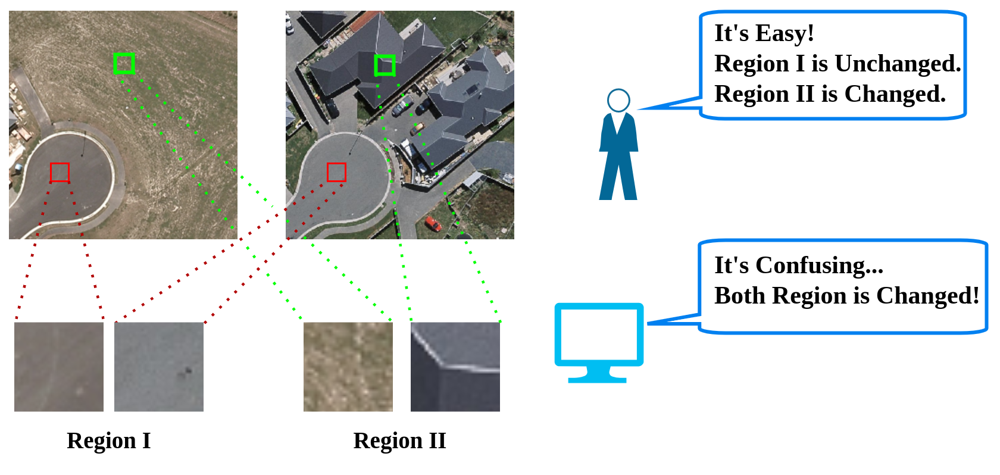

# CFNet: Optimizing Remote Sensing 🗺️ Change Detection 🕵 through Content-Aware Enhancement
Official repository for the paper ["Can We Generate Images with CoT? Let's Verify and Reinforce Image Generation Step by Step"].

[[🤗Checkpoints](https://huggingface.co/wifibk/CFNet/tree/main)]

## 🎊 News
- **[2025.3.11]** We release the code and checkpoints for CFNet 🚀
- **[2025.3.11]** We release the [arixv paper] 🚀

## 🤔 Addressing Style Variations in Change Detection
Change detection plays a crucial role in remote sensing, enabling the identification and analysis of temporal changes in the same geographical area. However, bi-temporal remote sensing images often exhibit significant style variations due to differences in acquisition conditions. These unpredictable variations pose a challenge to deep neural networks (DNNs), affecting their ability to accurately detect changes.

      

To address this, we propose **Content Focuser Network (CFNet)**. CFNet achieves state-of-the-art performance on three well-known change detection datasets: **CLCD (F1: 81.41%, IoU: 68.65%)**, **LEVIR-CD (F1: 92.18%, IoU: 85.49%)**, and **SYSU-CD (F1: 82.89%, IoU: 70.78%)**. 

      

The main contributions of our work:
- **Content-Aware strategy**, a novel content-based constraint learning strategy that enhances the model's focus on intrinsic content features while **reducing the impact of style variations**, thereby improving the accuracy and robustness of bi-temporal change detection in remote sensing imagery.
- **Focuser module**, a novel mechanism that dynamically reweights features to focus on both changed and unchanged areas, leveraging their **mutual constraints** to enhance parameter regularization and improve model accuracy.

**The visualization results on the CLCD dataset** demonstrate the great performance of CFNet. For better readability, we present only the results from CLCD here. For a comprehensive view, including visualizations on all three datasets, please refer to our paper.

      

