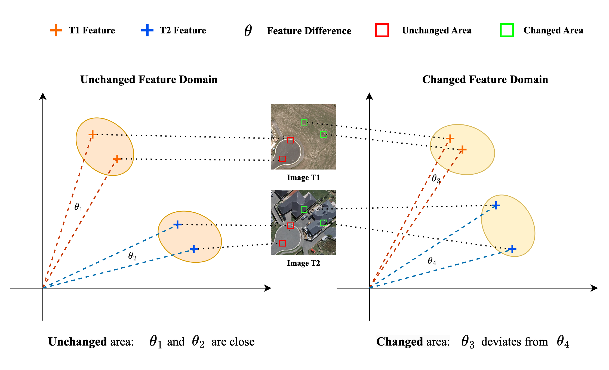
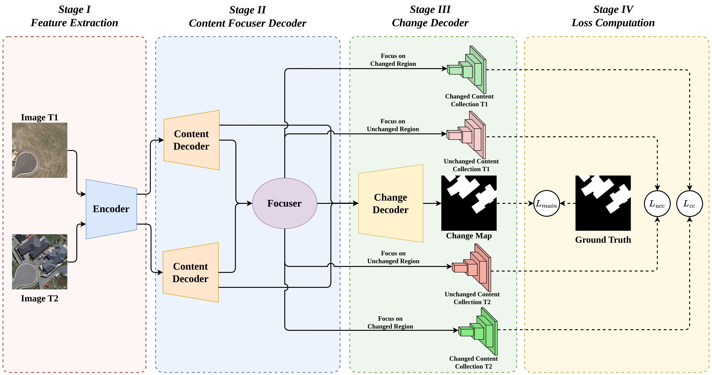
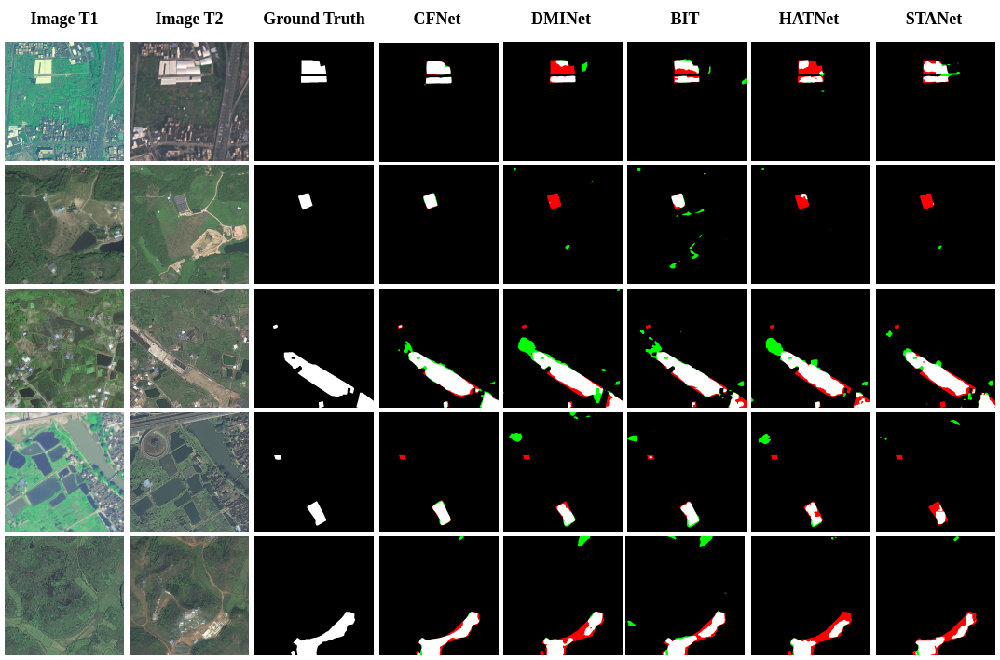
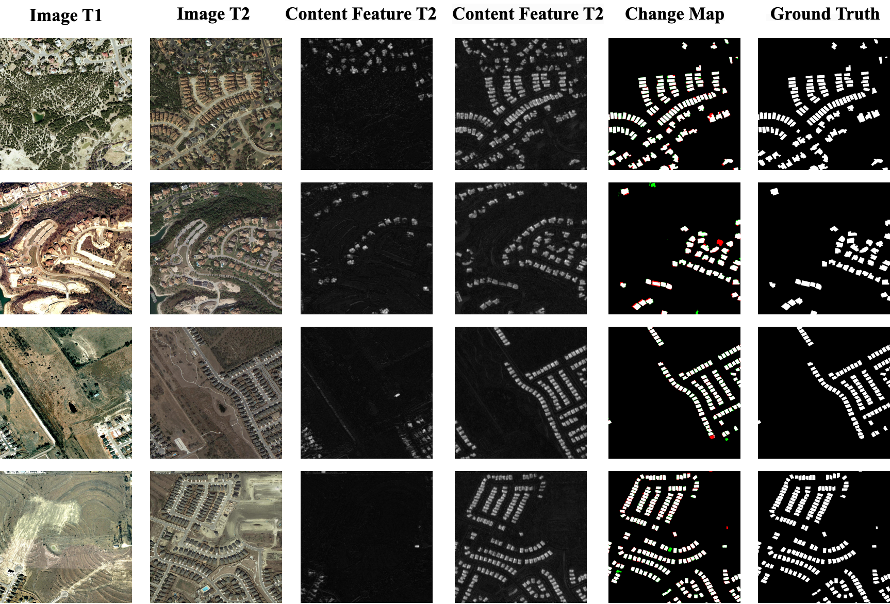

# CFNet: Optimizing Remote Sensing 🗺️ Change Detection 🕵 through Content-Aware Enhancement
Official repository for the paper ["CFNet: Optimizing Remote Sensing Change Detection through Content-Aware Enhancement"](https://arxiv.org/pdf/2503.08505).

[[🤗Datasets](https://huggingface.co/datasets/wifibk/CFNet_Datasets/tree/main)]  [[🤗Checkpoints](https://huggingface.co/wifibk/CFNet/tree/main)]

## 🐣 News
- **[2025.5.25]** The paper is accepted by **J-STARS** 🎉
- **[2025.3.11]** We release the code and checkpoints for CFNet 🚀
- **[2025.3.11]** We release the [arixv paper](https://arxiv.org/pdf/2503.08505) 🚀

## 🤔 Addressing Style Variations in Change Detection
Change detection plays a crucial role in remote sensing, enabling the identification and analysis of temporal changes in the same geographical area. However, bi-temporal remote sensing images often exhibit significant style variations due to differences in acquisition conditions. These unpredictable variations pose a challenge to deep neural networks (DNNs), affecting their ability to accurately detect changes.

<p align="center">
     <br>
</p>

To address the problem above, we propose **Content Focuser Network (CFNet)**. CFNet achieves state-of-the-art performance on three well-known change detection datasets: **CLCD (F1: 81.41%, IoU: 68.65%)**, **LEVIR-CD (F1: 92.18%, IoU: 85.49%)**, and **SYSU-CD (F1: 82.89%, IoU: 70.78%)**.  🚀 

<p align="center">
     <br>
</p>

The main contributions of our work:
- **Content-Aware strategy**, a novel content-based constraint learning strategy that enhances the model's focus on intrinsic content features while **reducing the impact of style variations**, thereby improving the accuracy and robustness of bi-temporal change detection in remote sensing imagery.
- **Focuser module**, a novel mechanism that dynamically reweights features to focus on both changed and unchanged areas, leveraging their **mutual constraints** to enhance parameter regularization and improve model accuracy.

**The visualization results on the CLCD dataset** demonstrate the great performance of CFNet. For better readability, we present only the results from CLCD here. For a comprehensive view, including visualizations on all three datasets, please refer to our paper.
<p align="center">
     <br>
</p>

**To further illustrate the effectiveness of the Content-Aware strategy in extracting content features**, we visualize the largest-scale feature maps output by the Content Decoder. Since the LEVIR-CD dataset primarily focuses on building changes, the content features predominantly represent structural information related to buildings). 

<p align="center">
     <br>
</p>

## 🏁 Get Start
### Installation
1. Clone the repository:
```bash
git clone https://github.com/wifiBlack/CFNet.git
cd CFNet
```

2. Create the environment

```bash
conda env create -f requirements.yml
conda activate cfnet_env
```

3. Prepare the checkpoints
```bash
git clone https://huggingface.co/wifibk/CFNet
mv ./CFNet ./checkpoints
```

### Playground
You can debug **playground.py** step by step to gain a deeper understanding of CFNet. Enjoy exploring it! 🥰

### Prepare Datasets
You can download the datasets from [CFNet-Datasets](https://huggingface.co/datasets/wifibk/CFNet_Datasets/tree/main).

We provide a preprocessed version of the original datasets to make it easier for you to experiment with CFNet!

You can simply run following commands to **get data from huggingface repository**. The data will be downloaded under CFNet folder.
```bash
# CLCD && CLCD-processed
python get_data.py CLCD.tar.gz
python get_data.py CLCD-processed.tar.gz

# LEVIR-CD && LEVIR-CD-processed
python get_data.py LEVIR_CD.tar.gz
python get_data.py LEVIR-CD-processed.tar.gz

# SYSU-CD
python get_data.py SYSU-CD.tar.gz
```
### Train
Run the following command to **train CFNet**. 
```bash
# CLCD dataset
python run.py --data-dir CLCD-processed \
              --log-dir logs_clcd \
              --gpu 0 \
              --epochs 100 \
              --batch-size 32 \
              --num-workers 16 \
              --lr 0.0005 
            #   --checkpoints \

# LEVIR-CD dataset
python run.py --data-dir LEVIR-CD-processed \
              --log-dir logs_levircd \
              --gpu 0 \
              --epochs 100 \
              --batch-size 32 \
              --num-workers 16 \
              --lr 0.0005 
            #   --checkpoints \

# SYSU-CD dataset
python run.py --data-dir SYSU-CD \
              --log-dir logs_sysucd \
              --gpu 0 \
              --epochs 100 \
              --batch-size 32 \
              --num-workers 16 \
              --lr 0.0005 
            #   --checkpoints \
```             

### Test
Run the following command to **test the performance of CFNet**.

```bash
# CLCD dataset
python test.py \
 --data-dir CLCD \
 --gpu 0 \
 --batch-size 8 \
 --num-workers 8 \
 --checkpoint checkpoints/clcd.pth

 # LEVIR-CD dataset
python test.py \
 --data-dir LEVIR-CD \
 --gpu 0 \
 --batch-size 8 \
 --num-workers 8 \
 --checkpoint checkpoints/levir-cd.pth

 # SYSU-CD dataset
python test.py \
 --data-dir SYSU-CD \
 --gpu 0 \
 --batch-size 8 \
 --num-workers 8 \
 --checkpoint checkpoints/sysu-cd.pth
```

## ✅ Citation
If this project contributes to your research or applications, please consider citing it using the following BibTeX:
```latex
@article{
    wu2025cfnet,
    title={CFNet: Optimizing Remote Sensing Change Detection through Content-Aware Enhancement},
    author={Wu, Fan and Dong, Sijun and Meng, Xiaoliang},
    journal={IEEE Journal of Selected Topics in Applied Earth Observations and Remote Sensing},
    year={2025},
    publisher={IEEE}
}

@misc{
    wu2025cfnetoptimizingremotesensing,
    title={CFNet: Optimizing Remote Sensing Change Detection through Content-Aware Enhancement}, 
    author={Fan Wu and Sijun Dong and Xiaoliang Meng},
    year={2025},
    eprint={2503.08505},
    archivePrefix={arXiv},
    primaryClass={cs.CV},
    url={https://arxiv.org/abs/2503.08505}, 
}
```
